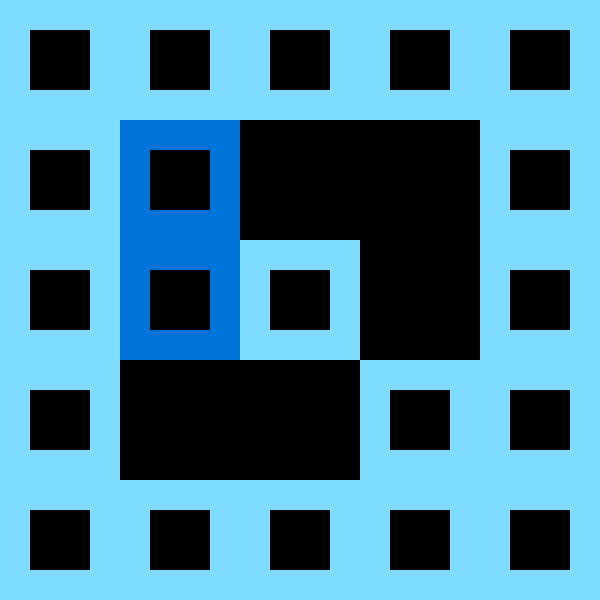
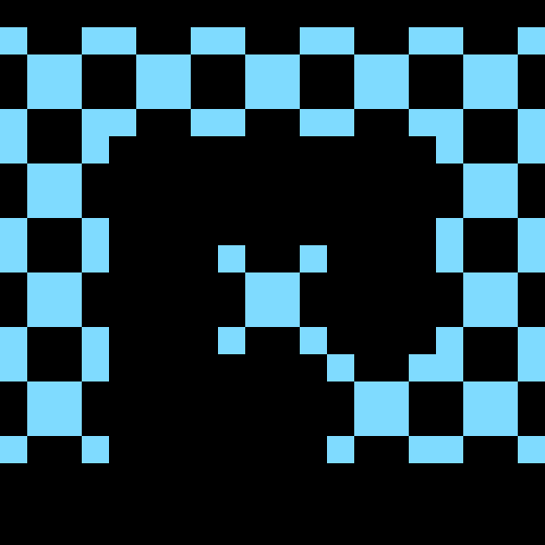
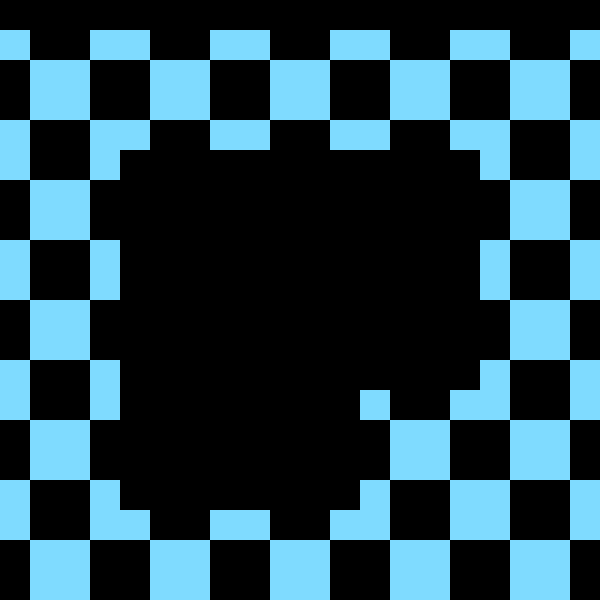
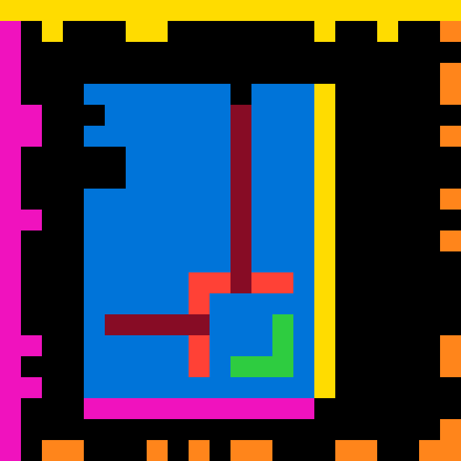
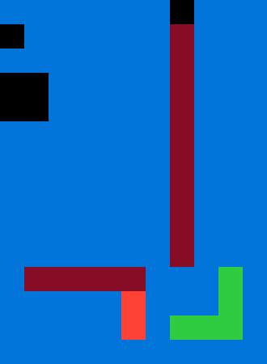
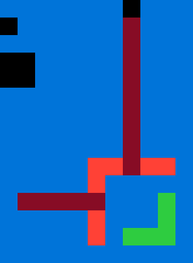

I built a Python solver with Claude 🤖 over the weekend to test an idea I had—could treating ARC-AGI-2 puzzles as visual pattern recognition tasks rather than symbolic manipulation problems actually work? The arc_visual_solver employs a phased visual approach by converting numerical grids into PNG images and leveraging GPT-5's multimodal capabilities. The solver progressively feeds training examples through distinct phases: first showing an input-output pair as color-coded images using a fixed palette mapping 0-9 to specific colors, then presenting subsequent training inputs and asking the model to predict outputs before revealing the actual answers. Throughout this process, the solver maintains conversation history and emphasizes key principles in its prompts—that transformations are deterministic and reproducible, that symbols may have semantic significance through their visual properties, and that compositional reasoning with turn-by-turn rule application may be necessary.

The technical implementation uses GPT-5-thinking model, configured with high reasoning effort and function calling capabilities. The solver provides a visualization tool that the model can invoke to generate intermediate grid representations during its reasoning process, allowing for iterative refinement of hypotheses. In successful runs, GPT-5 utilized the tool more than usual, getting a visual representation of a few different approaches. This approach aligns with François Chollet's emphasis on the importance of visual reasoning and compositional generalization—rather than relying purely on pattern memorization, the visual format may help the model identify transformation rules that are more apparent through visual inspection than numerical analysis, potentially engaging different reasoning pathways that are less dependent on training data contamination.

I achieved a 40% score on ARC-AGI-2's evaluation dataset in initial testing of only 10 sample problems, which needs more investigation but represents a significant improvement over the current AI state-of-the-art of 15.9%. Each problem cost roughly $0.90 in tokens to solve. The visual approach may be tapping into the importance of perceptual grounding in abstract reasoning—by presenting puzzles as images rather than symbolic representations, the model might be engaging different cognitive pathways that are less dependent on memorized patterns and more focused on genuine visual pattern recognition. The fact that extensive exploration is needed suggests the model is doing sophisticated pattern matching, but the visual format may help distinguish between superficial statistical correlations and meaningful geometric transformations. Testing on guaranteed unseen data is needed for legitimate validation. Even if the 40% score still reflects some degree of training data influence, the methodology demonstrates that visual reasoning approaches can substantially improve AI performance on abstract reasoning tasks—notably, naive prompting without visuals failed on problems where the visual solver succeeded, suggesting the visual format itself may be key to accessing latent reasoning capabilities.

The detailed analysis of GPT-5's problem-solving patterns reveals genuinely sophisticated behavior that goes beyond simple pattern matching. The model demonstrates systematic hypothesis formation, developing explicit testable rules after examining each training example, and shows progressive refinement when predictions fail—genuinely revising its understanding rather than making superficial adjustments. Perhaps most remarkably, GPT-5 actively uses the visualization tool to test hypotheses, showing exploratory behavior, and frequently assigns meaningful semantic labels to patterns like "onion layers," "rooms and corridors," or "anchor points," suggesting it's building abstract representations rather than just processing pixels. The model consistently acknowledges ambiguity explicitly, emphasizes finding rules that work across ALL examples (showing understanding of determinism requirements), and demonstrates self-correction capabilities by identifying specific aspects of failed rules rather than starting over.

Success patterns cluster around compositional decomposition, invariant detection, and multi-level pattern recognition, while failures typically involve over-specification, ambiguous ordering rules, and edge case handling. The visual approach appears to activate different reasoning pathways through Gestalt principles, direct spatial reasoning engagement, and immediate pattern salience that makes visual patterns like hollow squares or connected regions apparent without requiring coordinate arithmetic. While the 40% success rate shows both potential and limitations, the systematic exploration and genuine problem-solving behavior observed suggests that visual presentation may indeed unlock spatial reasoning capabilities that purely symbolic approaches fundamentally miss.


### Setup and running

1. Clone repo
2. `export OPENAI_API_KEY=...`
3. `python3 arc_visual_solver.py ARC-AGI-2/data/training/00576224.json`
4. Or `python3 run_batch.py 10 -e -v -p 5` (runs 10 random problems from the evaluation set across 5 workers using the visual solver)
4. Use help menu to see other options (what dataset to run, run in parallel, etc.)
5. There are a few little helper python scripts for visualization

### Results 

```
================================================================================
BATCH RESULTS SUMMARY
================================================================================
Total tasks: 10
Successful: 4 (40.0%)
Failed: 6 (60.0%)
Total time: 9840.03s
Total phases: 51

Detailed Results:
Task                 Result     Time (s)   Phases    
--------------------------------------------------
2ba387bc             ✅ PASS     337.62     6         
3e6067c3             ✅ PASS     905.73     5         
dfadab01             ❌ FAIL     1064.52    6         
2d0172a1             ❌ FAIL     1207.07    6         
6e4f6532             ❌ FAIL     1387.00    4         
1ae2feb7             ✅ PASS     477.20     5         
de809cff             ❌ FAIL     1236.57    4         
fc7cae8d             ❌ FAIL     1189.15    5         
58490d8a             ✅ PASS     777.47     5         
89565ca0             ❌ FAIL     1257.71    5         

```

Example: when comparing failed problems to GPT-5 prompting without visuals it becomes clear that the visual solver got much further than a naive implementation would have

| GPT-5 (Naive) | Visual Solver | Correct |
|:-------------:|:-------------:|:-------:|
|  |  |  |

Example: iterating with tools to improve strategy and comparing results to output 

| Input | Output | Tool iteration 1 | Tool iteration 2 | Tool iteration 3 | Tool iteration 4 |
|:-----:|:------:|:---------------:|:---------------:|:---------------:|:---------------:|
|  |  |  |  |  |  |

